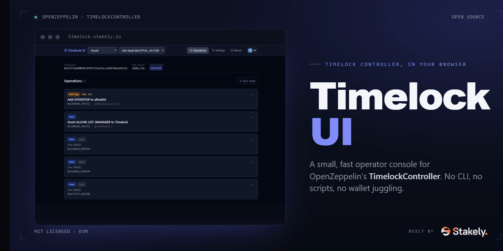

<p align="center">
  
</p>

<h1 align="center">Timelock UI</h1>

<p align="center">
  Minimal, chain-agnostic interface to operate any
  <a href="https://docs.openzeppelin.com/contracts/5.x/api/governance#TimelockController">OpenZeppelin TimelockController</a>
  from the browser.
</p>

<p align="center">
  <a href="https://timelock.stakely.io">
    
  </a>
  <a href="LICENSE">
    
  </a>
  
  
  
  
</p>

---

## What it does

Schedule, monitor, and execute timelocked operations on any EVM chain.  
Connect your wallet, paste a `TimelockController` address, and you're ready to go. No backend, no setup, no vendor lock-in.

- **Any network.** Mainnet, Sepolia, Hoodi, any L2 or custom RPC you configure.
- **Any contract.** Paste any `TimelockController` address. No hardcoded deployments.
- **No backend.** Everything runs in the browser; state is persisted in `localStorage`.
- **Non-custodial.** Your wallet signs every transaction; the app never touches your keys.
- **Wallet-agnostic.** MetaMask, Coinbase, Rainbow, WalletConnect. Any Safe via WalletConnect.

## Live demo

**[timelock.stakely.io](https://timelock.stakely.io)**, hosted by [Stakely](https://stakely.io), free to use.

You can also self-host your own instance (see [Self-hosting](#self-hosting)).

## How it works

The classic timelock flow:

```
schedule  →  wait delay  →  execute
```

1. **Schedule.** Submit a `schedule()` transaction with the target, calldata, and a delay. The operation is queued on-chain and a countdown starts.
2. **Wait.** The operation stays in `Waiting` state until the delay elapses, then becomes `Ready`.
3. **Execute.** Any account with `EXECUTOR_ROLE` calls `execute()`. Any account with `CANCELLER_ROLE` can call `cancel()` instead.

The UI also picks up operations scheduled outside of it: the **Sync chain** button scans `CallScheduled` events so you can monitor a Timelock you don't control.

## Self-hosting

Deploy your own instance in minutes:

```bash
git clone https://github.com/stakely/timelock-ui.git
cd timelock-ui
npm install
npm run build
# Serve dist/ with any static host: Vercel, Netlify, Nginx, IPFS, …
```

For local development:

```bash
cp .env.example .env       # set your WalletConnect Project ID (optional)
npm run dev                 # http://localhost:5173
npm run preview             # preview the production build
```

## WalletConnect Project ID

Copy `.env.example` to `.env` and set your own Project ID (free at [cloud.reown.com](https://cloud.reown.com)):

```bash
VITE_WC_PROJECT_ID=your_project_id
```

The app falls back to a bundled public ID if the variable is not set. Fine for local dev, but use your own for production.

## Stack

| Package | Role |
|---------|------|
| [Vite](https://vitejs.dev) + [React 19](https://react.dev) + [TypeScript](https://typescriptlang.org) | Core framework |
| [wagmi v2](https://wagmi.sh) + [viem](https://viem.sh) | On-chain reads & writes |
| [RainbowKit](https://rainbowkit.com) | Wallet connection |
| [TailwindCSS v4](https://tailwindcss.com) | Styling |
| [TanStack Query](https://tanstack.com/query) | Async state / caching |
| [React Router v7](https://reactrouter.com) | Client-side routing |
| [Lucide React](https://lucide.dev) | Icons |

## Storage

All state lives in `localStorage` under the `tl-ui:*` namespace:

| Key | Contents |
|-----|----------|
| `tl-ui:networks` | Configured networks (chainId, RPC, explorer) |
| `tl-ui:timelocks` | Configured timelock contracts |
| `tl-ui:active-timelock` | Currently selected timelock address |
| `tl-ui:operations:<chainId>:<address>` | Operations per timelock |
| `tl-ui:sync-cursor:<chainId>:<address>` | Last block scanned for incremental sync |

Clearing site data resets the app completely.

## Contributing

Pull requests are welcome. The codebase is small and self-contained: no Solidity, no backend, just a frontend talking to the chain through viem.

For bugs or feature requests, open an issue at [github.com/stakely/timelock-ui/issues](https://github.com/stakely/timelock-ui/issues).

```bash
npm run lint     # ESLint
npm run build    # type-check + production build
```

## License

[MIT](LICENSE) © [Stakely](https://stakely.io)
